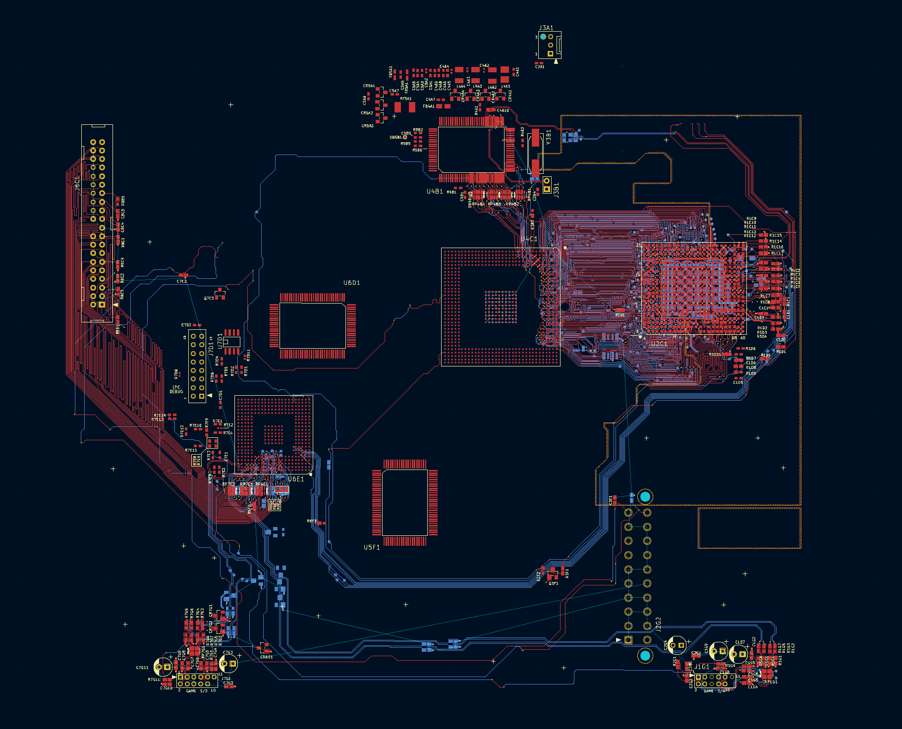

# Xbox Original Mainboard Reverse Engineering

This project is an attempt to recreate the Xbox 1.6 mainboard in Kicad. The first goal is to recreate the layout of the PCB then recover the netlist then draw the schematic.

Note: [Custom version of Kicad](https://github.com/maximus64/kicad/tree/maximus/xbox_project) are required to load this project. The official version of Kicad has bitmap surface cache size limmiter and stores bitmap data as base64 encoded data. The patch removes the surface cache size constraint and just stores the image path rather than the store the bitmap data as base64 encoding. This is done to enhance performance so that Kicad can display the board scan overlay and re-trace the mainboard layout.

## Board scan

Scan image of all the copper layers is in kicad/xbox_1.6/board_scan/1.6

### PCB stackup

1. Signal
2. Ground
3. Power
4. Signal

### Progress

